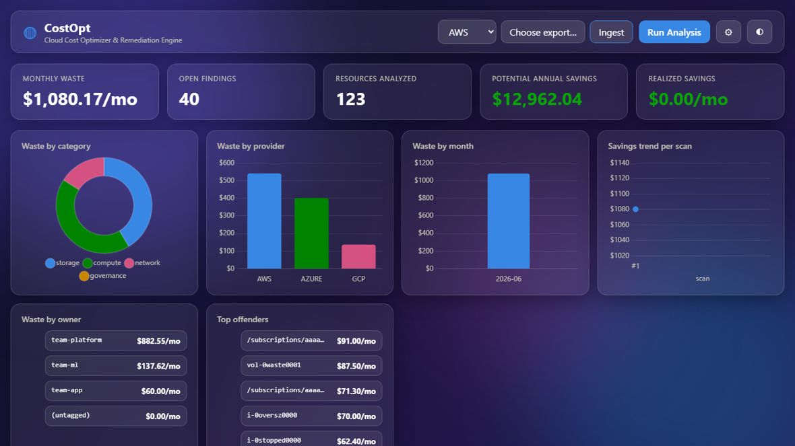
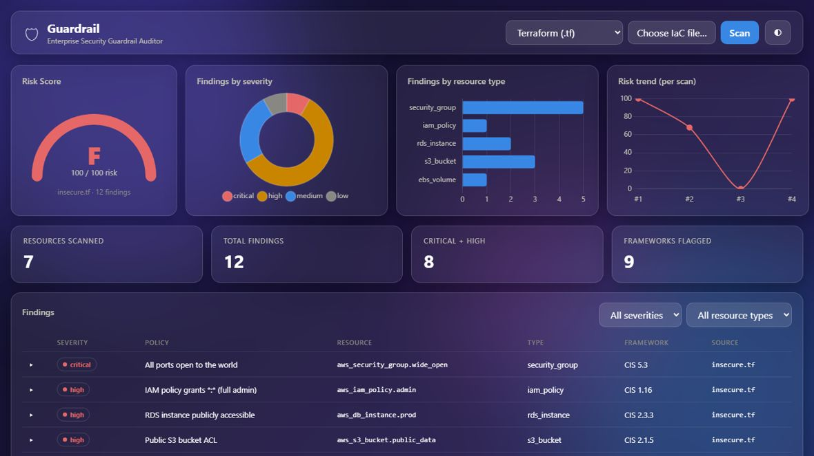
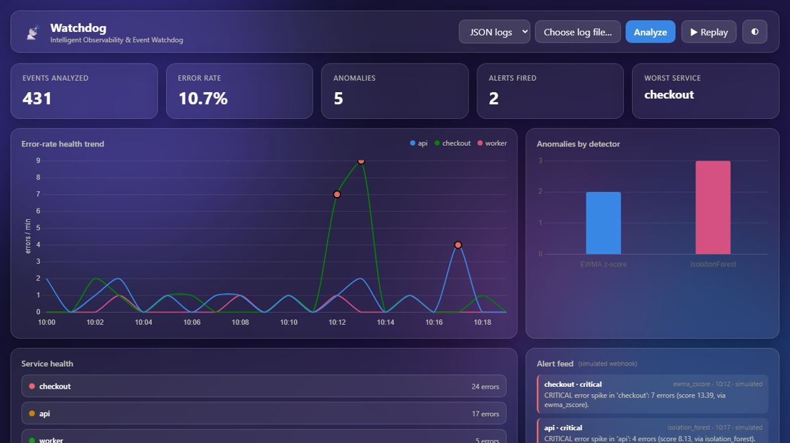

<h1 align="center">Cloud Platform Suite</h1>

<p align="center">
  <strong>Three production platforms — FinOps, Compliance, SRE — on one shared, extensible core.</strong><br>
  Built entirely by <em>vibe coding</em>: I architected and directed an AI engineer; I never edited a line of code by hand.
</p>

<p align="center">
  
  
  
  
</p>

---

## What this is

Three of the Graduate Vibe Coding Challenge projects — built as **one monorepo** so they share
a single hexagonal core (`common/`): a plugin registry, SQLite adapter, FastAPI app-factory, and
a glassmorphism dashboard chassis. Adding a cloud, a security rule, a log detector, or an alert
channel is **one new file with a decorator — the engine never changes.** That open/closed design is
the whole point: extension cost stays O(1) no matter how far each product grows.

| | Project | Focus | In one line |
|---|---|---|---|
| 💰 | **[CostOpt](apps/costopt)** | FinOps | Ingests AWS/Azure/GCP/FOCUS billing exports, finds orphaned/wasteful resources, and generates the exact CLI + SDK commands to decommission them. |
| 🛡️ | **[Guardrail](apps/guardrail)** | Compliance | Audits Terraform (HCL + plan JSON) and CloudFormation against a CIS-aligned baseline and renders a 0–100 **Risk Score**. |
| 📡 | **[Watchdog](apps/watchdog)** | SRE | Parses JSON/syslog/text logs, detects error-rate spikes (online EWMA z-score **+** IsolationForest ML), and fires simulated webhook alerts. |

## Dashboards

<table>
  <tr>
    <td width="33%"><br><sub><b>CostOpt</b> — waste by category, provider, owner + savings trend</sub></td>
    <td width="33%"><br><sub><b>Guardrail</b> — risk-score gauge, findings by severity & CIS control</sub></td>
    <td width="33%"><br><sub><b>Watchdog</b> — error-rate health trend with anomaly markers + alert feed</sub></td>
  </tr>
</table>

## Architecture

```
common/           shared core — plugin registry · SQLite helpers · FastAPI app-factory + auth · theme tokens
apps/
  costopt/        Project 1 — Cloud Cost Optimizer & Remediation Engine (FinOps)
  guardrail/      Project 2 — Enterprise Security Guardrail Auditor (Compliance)
  watchdog/       Project 3 — Intelligent Observability & Event Watchdog (SRE)
docs/
  presentation/   the submission deck (HTML + Markdown)
  superpowers/    per-project design specs and implementation plans
prompts.md        full prompt-by-prompt audit log of the entire build
```

Every app is the same pipeline — **ingest → normalize to a common IR → pluggable analyzers
(registry) → score/alert → SQLite → FastAPI → dashboard.** The normalized IR is what makes new
input formats cheap; the registry is what makes new rules/detectors cheap. Where it matters,
the design is deliberately efficient: Guardrail dispatches policies by resource type (O(R+M),
never rules×resources); Watchdog's EWMA detector is O(1) time and space per event, so memory
stays bounded at any log volume.

## Quick start

```bash
python -m venv .venv
.venv/Scripts/pip install -r requirements.txt          # Windows (use bin/pip on macOS/Linux)
.venv/Scripts/python -m playwright install chromium     # once, for the browser tests

# run any app from the repo root:
python -m uvicorn apps.costopt.api.main:app   --port 8000   # → CostOpt
python -m uvicorn apps.guardrail.api.main:app --port 8001   # → Guardrail
python -m uvicorn apps.watchdog.api.main:app  --port 8002   # → Watchdog
```

Each app opens on a glassmorphism dashboard (dark/light), ships generated sample data under
`apps/<app>/sample_data/`, and exposes interactive API docs at `/docs`.

## Tests — 221, all green

```bash
python -m pytest -q                      # 196 unit + API tests across all apps + common core
python -m pytest apps/*/tests/e2e -q     # 25 Playwright browser journeys on Chrome
```

Every feature shipped green across three independent tiers — unit, API end-to-end, and
real-browser journeys — plus an agent-driven manual pass. Nothing was called "done" without
fresh test output to prove it.

## Tech stack

Python 3.11 · FastAPI · SQLAlchemy 2 (SQLite) · pydantic v2 · APScheduler ·
python-hcl2 + PyYAML (IaC parsing) · scikit-learn (ML anomaly detector) ·
pytest + httpx + Playwright · Chart.js + vanilla-JS glassmorphism dashboards.

---

## About this build — the Vibe Coding Challenge

This repository is a submission for the Graduate **Vibe Coding Challenge**: *"You are the
architect; the AI is the engineer."* The entire codebase was produced under a Lead-Architect
protocol — **no manual code edits**, every prompt logged, time-boxed with elapsed-time checkpoints.

- **Approach & mindset (Tagle Tag):** *The Pioneer, with an Architect edge* — "You don't wait for
  the future, you build it." (Innovation 69 · Competence 69 · Autonomy 63 · Relatedness 63 · Growth 53)
- **Audit log:** [`prompts.md`](prompts.md) — the full prompt-by-prompt trail of the build.
- **Presentation:** [`docs/presentation/`](docs/presentation) — the deck in HTML and Markdown.
- **Cloud decommission:** none required — the suite runs entirely on a free-tier local database
  (SQLite) with generated sample data, so there are no billable cloud resources and no residual cost.

> The brief asked for **one** of the three projects. This delivers **all three** on a shared core,
> plus ten additional production features on CostOpt — a demonstration that the real graduate edge
> is architecture and direction, not typing speed.

## Backlog (production-hardening)

Postgres swap (the repo adapter is ready) · real CUR/FOCUS/FOCUS-full schema coverage ·
CloudWatch/Azure Monitor metrics for true idleness · real (non-simulated) remediation execution
behind SSO/RBAC · live log-stream ingestion for Watchdog · multi-currency.
